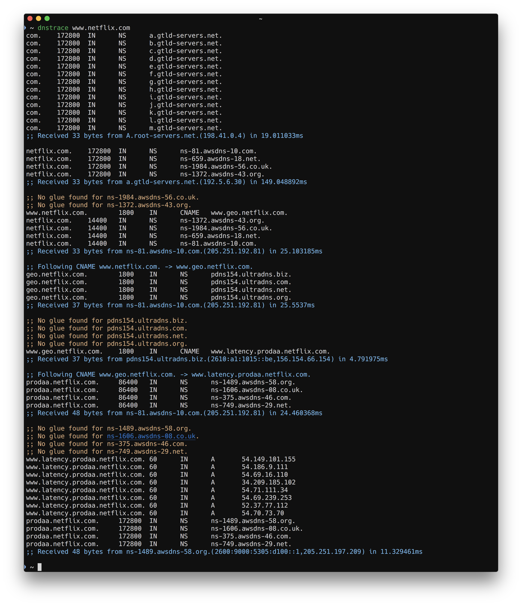

# dnstrace

This tool performs a DNS resolution by tracing the delegation path from the root name servers, and by following the CNAME chain. Each query is reported with statistics about all delegated name servers.

## Features

* Follow CNAMEs
* Query all name servers in parallel and report stats for each
* Report about non glued name server lookup time
* Enable DNSSEC query option to better emulate name server queries
* Compute the cold best path as if the resolver started with an empty cache to recurse queried name

## Usage

```
Usage: dnstrace [qtype] <domain>

  -color
    	Enable/disable colors (default true)
```



## Install

Using [homebrew](http://brew.sh/):

```
brew install rs/tap/dnstrace
```

From source:

```
go get github.com/rs/dnstrace
```

Or download a [binary package](https://github.com/rs/dnstrace/releases/latest).

# License

All source code is licensed under the [MIT License](https://raw.github.com/rs/dnstrace/master/LICENSE).
